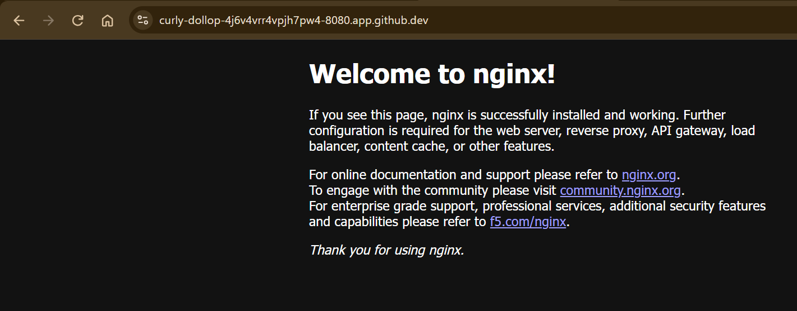
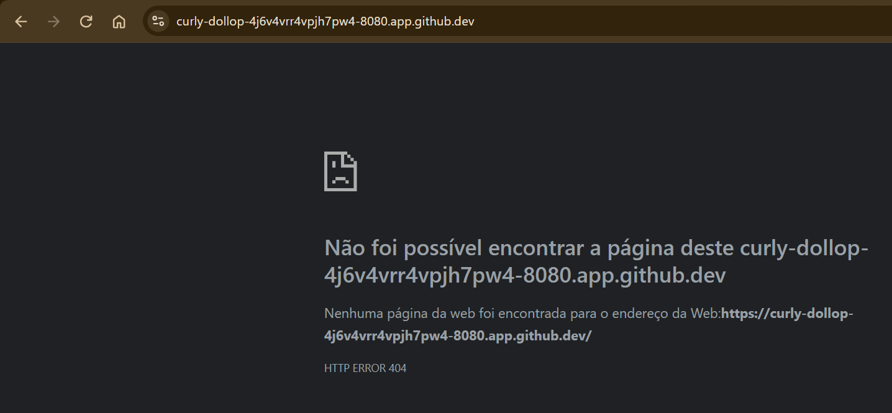
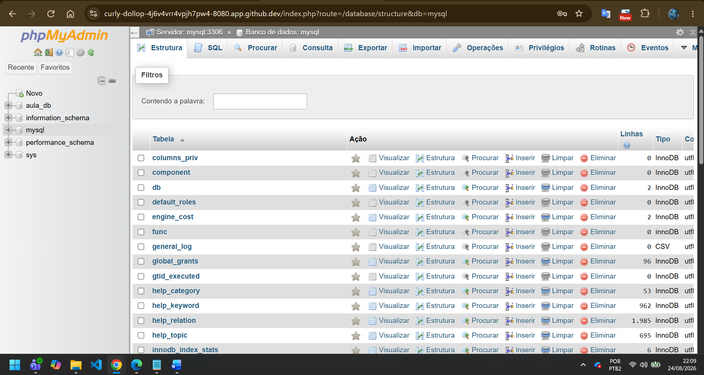
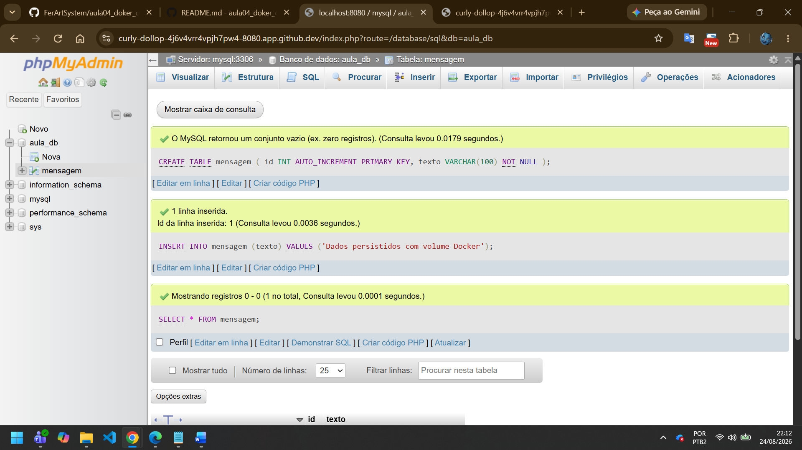
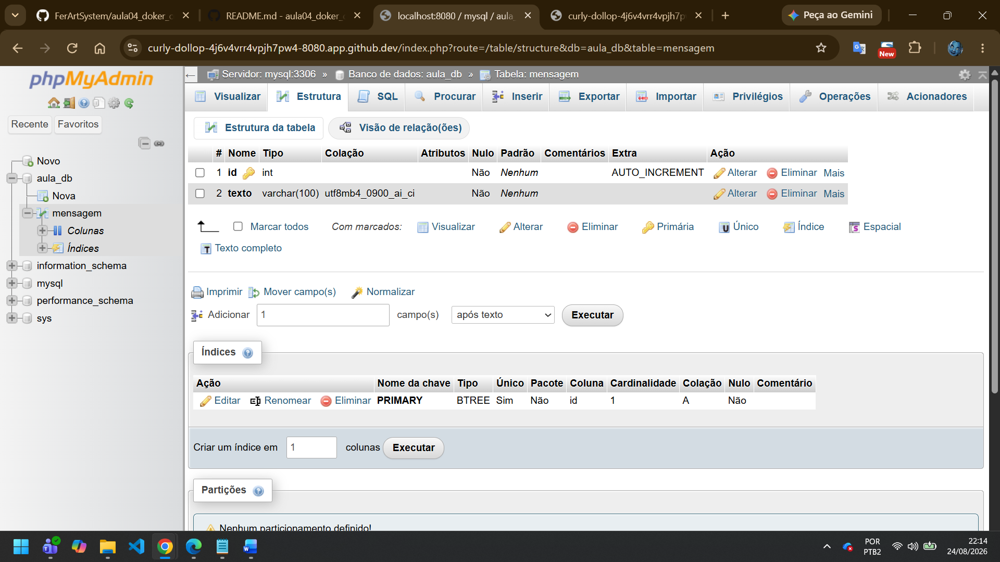

# aula04_doker_codespaces
Está é a aula 04, feita no dia 24/08/2026 a qual tratará de Doker e Codespaces
'''
$ docker --version
Docker version 29.3.0-1, build 5927d80c76b3ce5cf782be818922966e8a0d87a3

$ docker info
Client:
 Version:    29.3.0-1
 Context:    default
 Debug Mode: false
 Plugins:
  buildx: Docker Buildx (Docker Inc.)
    Version:  v0.32.1
    Path:     /usr/libexec/docker/cli-plugins/docker-buildx
  compose: Docker Compose (Docker Inc.)
    Version:  v2.40.3
    Path:     /usr/libexec/docker/cli-plugins/docker-compose

Server:
 Containers: 0
  Running: 0
  Paused: 0
  Stopped: 0
 Images: 0
 Server Version: 29.3.0-1
 Storage Driver: overlayfs
  driver-type: io.containerd.snapshotter.v1
 Logging Driver: json-file
 Cgroup Driver: cgroupfs
 Cgroup Version: 2
 Plugins:
  Volume: local
  Network: bridge host ipvlan macvlan null overlay
  Log: awslogs fluentd gcplogs gelf journald json-file local splunk syslog
 CDI spec directories:
  /etc/cdi
  /var/run/cdi
 Swarm: inactive
 Runtimes: io.containerd.runc.v2 runc
 Default Runtime: runc
 Init Binary: docker-init
 containerd version: dea7da592f5d1d2b7755e3a161be07f43fad8f75
 runc version: 8bd78a9977e604c4d5f67a7415d7b8b8c109cdc4
 init version: 
 Security Options:
  apparmor
  seccomp
   Profile: builtin
  cgroupns
 Kernel Version: 6.8.0-1052-azure
 Operating System: Ubuntu 24.04.4 LTS (containerized)
 OSType: linux
 Architecture: x86_64
 CPUs: 2
 Total Memory: 7.758GiB
 Name: codespaces-5de8fa
 ID: 96de4144-6f30-4271-b5a6-aada242f8886
 Docker Root Dir: /var/lib/docker
 Debug Mode: false
 Username: codespacesdev
 Experimental: false
 Insecure Registries:
  ::1/128
  127.0.0.0/8
 Live Restore Enabled: false
 Firewall Backend: iptables
 '''

'''
$ docker pull nginx:latest
latest: Pulling from library/nginx
7eb55399d6de: Pull complete 
f530c3e421fc: Pull complete 
5d480233f531: Pull complete 
746b934a8960: Pull complete 
5508f6432d3e: Pull complete 
128fcc7b23b0: Pull complete 
26c307b5e35a: Pull complete 
3976f7b8a9d7: Download complete 
81dd0279e705: Download complete 
Digest: sha256:0d4374c710a9649200e84f8ef8dbdd4fa76c0c107839cd50f1e42a63916b0f2e
Status: Downloaded newer image for nginx:latest
docker.io/library/nginx:latest

$ docker images                                                                                                      i Info →   U  In Use
IMAGE          ID             DISK USAGE   CONTENT SIZE   EXTRA
nginx:latest   0d4374c710a9        241MB         66.2MB        

$ docker run -d --name meu_nginx -p 8080:80 nginx:latest
e358c24f838dfc7731783be507a97de0801aedc268d90c12cd33bdc5cca3276b

$ docker ps
CONTAINER ID   IMAGE          COMMAND                  CREATED              STATUS              PORTS                                     NAMES
e358c24f838d   nginx:latest   "/docker-entrypoint.…"   About a minute ago   Up About a minute   0.0.0.0:8080->80/tcp, [::]:8080->80/tcp   meu_nginx

$ docker ps --filter name=meu_nginx
CONTAINER ID   IMAGE          COMMAND                  CREATED              STATUS              PORTS                                     NAMES
e358c24f838d   nginx:latest   "/docker-entrypoint.…"   About a minute ago   Up About a minute   0.0.0.0:8080->80/tcp, [::]:8080->80/tcp   meu_nginx

$ docker logs meu_nginx
/docker-entrypoint.sh: /docker-entrypoint.d/ is not empty, will attempt to perform configuration
/docker-entrypoint.sh: Looking for shell scripts in /docker-entrypoint.d/
/docker-entrypoint.sh: Launching /docker-entrypoint.d/10-listen-on-ipv6-by-default.sh
10-listen-on-ipv6-by-default.sh: info: Getting the checksum of /etc/nginx/conf.d/default.conf
10-listen-on-ipv6-by-default.sh: info: Enabled listen on IPv6 in /etc/nginx/conf.d/default.conf
/docker-entrypoint.sh: Sourcing /docker-entrypoint.d/15-local-resolvers.envsh
/docker-entrypoint.sh: Launching /docker-entrypoint.d/20-envsubst-on-templates.sh
/docker-entrypoint.sh: Launching /docker-entrypoint.d/30-tune-worker-processes.sh
/docker-entrypoint.sh: Configuration complete; ready for start up
2026/08/24 23:37:30 [notice] 1#1: using the "epoll" event method
2026/08/24 23:37:30 [notice] 1#1: nginx/1.31.4
2026/08/24 23:37:30 [notice] 1#1: built by gcc 14.2.0 (Debian 14.2.0-19) 
2026/08/24 23:37:30 [notice] 1#1: OS: Linux 6.8.0-1052-azure
2026/08/24 23:37:30 [notice] 1#1: getrlimit(RLIMIT_NOFILE): 1024:524288
2026/08/24 23:37:30 [notice] 1#1: start worker processes
2026/08/24 23:37:30 [notice] 1#1: start worker process 29
2026/08/24 23:37:30 [notice] 1#1: start worker process 30

$ curl -I http://localhost:8080
HTTP/1.1 200 OK
Server: nginx/1.31.4
Date: Mon, 24 Aug 2026 23:40:00 GMT
Content-Type: text/html
Content-Length: 896
Last-Modified: Tue, 11 Aug 2026 20:02:04 GMT
Connection: keep-alive
ETag: "6a7b7fbc-380"
Accept-Ranges: bytes

$ docker exec -it meu_nginx sh
# ls /usr/share/nginx/html
50x.html  index.html
'''

 

'''
@FerArtSystem ➜ /workspaces/aula04_doker_codespaces (main) $ docker stop meu_nginx
meu_nginx
@FerArtSystem ➜ /workspaces/aula04_doker_codespaces (main) $ docker rm meu_nginx
meu_nginx
@FerArtSystem ➜ /workspaces/aula04_doker_codespaces (main) $ docker ps -a
CONTAINER ID   IMAGE     COMMAND   CREATED   STATUS    PORTS     NAMES
@FerArtSystem ➜ /workspaces/aula04_doker_codespaces (main) $ 
'''

'''
@FerArtSystem ➜ /workspaces/aula04_doker_codespaces (main) $ git add compose.yaml
@FerArtSystem ➜ /workspaces/aula04_doker_codespaces (main) $ git commit -m "Atualiza Compose da atividade"
[main 58f58d7] Atualiza Compose da atividade
 1 file changed, 25 insertions(+)
 create mode 100644 compose.yaml
@FerArtSystem ➜ /workspaces/aula04_doker_codespaces (main) $ git push
Enumerating objects: 4, done.
Counting objects: 100% (4/4), done.
Delta compression using up to 2 threads
Compressing objects: 100% (3/3), done.
Writing objects: 100% (3/3), 515 bytes | 257.00 KiB/s, done.
Total 3 (delta 1), reused 0 (delta 0), pack-reused 0 (from 0)
remote: Resolving deltas: 100% (1/1), completed with 1 local object.
To https://github.com/FerArtSystem/aula04_doker_codespaces
   b5135bd..58f58d7  main -> main
@FerArtSystem ➜ /workspaces/aula04_doker_codespaces (main) $ docker compose up -d
docker compose ps
[+] Running 35/35
 ✔ mysql Pulled                                                                                                      53.4s 
 ✔ phpmyadmin Pulled                                                                                                 45.4s 
[+] Running 4/4
 ✔ Network aula04_doker_codespaces_default    Created                                                                 0.1s 
 ✔ Volume aula04_doker_codespaces_mysql-data  Created                                                                 0.0s 
 ✔ Container aula-mysql                       Started                                                                 1.3s 
 ✔ Container aula-phpmyadmin                  Started                                                                 1.6s 
NAME              IMAGE               COMMAND                  SERVICE      CREATED         STATUS                  PORTS
aula-mysql        mysql:8.4           "docker-entrypoint.s…"   mysql        2 seconds ago   Up 1 second             0.0.0.0:3306->3306/tcp, [::]:3306->3306/tcp, 33060/tcp
aula-phpmyadmin   phpmyadmin:latest   "/docker-entrypoint.…"   phpmyadmin   2 seconds ago   Up Less than a second   0.0.0.0:8080->80/tcp, [::]:8080->80/tcp
@FerArtSystem ➜ /workspaces/aula04_doker_codespaces (main) $ 
'''

'''

@FerArtSystem ➜ /workspaces/aula04_doker_codespaces (main) $ docker compose config
docker compose ps
docker compose logs mysql --tail=50
name: aula04_doker_codespaces
services:
  mysql:
    container_name: aula-mysql
    environment:
      MYSQL_DATABASE: aula_db
      MYSQL_ROOT_PASSWORD: root_password
    image: mysql:8.4
    networks:
      default: null
    ports:
      - mode: ingress
        target: 3306
        published: "3306"
        protocol: tcp
    volumes:
      - type: volume
        source: mysql-data
        target: /var/lib/mysql
        volume: {}
  phpmyadmin:
    container_name: aula-phpmyadmin
    depends_on:
      mysql:
        condition: service_started
        required: true
    environment:
      PMA_HOST: mysql
      PMA_PORT: "3306"
    image: phpmyadmin:latest
    networks:
      default: null
    ports:
      - mode: ingress
        target: 80
        published: "8080"
        protocol: tcp
networks:
  default:
    name: aula04_doker_codespaces_default
volumes:
  mysql-data:
    name: aula04_doker_codespaces_mysql-data
NAME              IMAGE               COMMAND                  SERVICE      CREATED         STATUS         PORTS
aula-mysql        mysql:8.4           "docker-entrypoint.s…"   mysql        3 minutes ago   Up 2 minutes   0.0.0.0:3306->3306/tcp, [::]:3306->3306/tcp, 33060/tcp
aula-phpmyadmin   phpmyadmin:latest   "/docker-entrypoint.…"   phpmyadmin   3 minutes ago   Up 2 minutes   0.0.0.0:8080->80/tcp, [::]:8080->80/tcp
aula-mysql  | 2026-08-25 00:58:45+00:00 [Note] [Entrypoint]: Entrypoint script for MySQL Server 8.4.11-1.el9 started.
aula-mysql  | 2026-08-25 00:58:47+00:00 [Note] [Entrypoint]: Switching to dedicated user 'mysql'
aula-mysql  | 2026-08-25 00:58:47+00:00 [Note] [Entrypoint]: Entrypoint script for MySQL Server 8.4.11-1.el9 started.
aula-mysql  | 2026-08-25 00:58:47+00:00 [Note] [Entrypoint]: Initializing database files
aula-mysql  | 2026-08-25T00:58:47.817756Z 0 [System] [MY-015017] [Server] MySQL Server Initialization - start.
aula-mysql  | 2026-08-25T00:58:47.820123Z 0 [System] [MY-013169] [Server] /usr/sbin/mysqld (mysqld 8.4.11) initializing of server in progress as process 78
aula-mysql  | 2026-08-25T00:58:47.897165Z 1 [System] [MY-013576] [InnoDB] InnoDB initialization has started.
aula-mysql  | 2026-08-25T00:58:50.686396Z 1 [System] [MY-013577] [InnoDB] InnoDB initialization has ended.
aula-mysql  | 2026-08-25T00:58:53.212602Z 6 [Warning] [MY-010453] [Server] root@localhost is created with an empty password ! Please consider switching off the --initialize-insecure option.
aula-mysql  | 2026-08-25T00:58:57.993365Z 0 [System] [MY-015018] [Server] MySQL Server Initialization - end.
aula-mysql  | 2026-08-25 00:58:58+00:00 [Note] [Entrypoint]: Database files initialized
aula-mysql  | 2026-08-25 00:58:58+00:00 [Note] [Entrypoint]: Starting temporary server
aula-mysql  | 2026-08-25T00:58:58.107193Z 0 [System] [MY-015015] [Server] MySQL Server - start.
aula-mysql  | 2026-08-25T00:58:58.409015Z 0 [System] [MY-010116] [Server] /usr/sbin/mysqld (mysqld 8.4.11) starting as process 117
aula-mysql  | 2026-08-25T00:58:58.436805Z 1 [System] [MY-013576] [InnoDB] InnoDB initialization has started.
aula-mysql  | 2026-08-25T00:59:02.335262Z 1 [System] [MY-013577] [InnoDB] InnoDB initialization has ended.
aula-mysql  | 2026-08-25T00:59:02.596112Z 0 [Warning] [MY-010068] [Server] CA certificate ca.pem is self signed.
aula-mysql  | 2026-08-25T00:59:02.596150Z 0 [System] [MY-013602] [Server] Channel mysql_main configured to support TLS. Encrypted connections are now supported for this channel.
aula-mysql  | 2026-08-25T00:59:02.599044Z 0 [Warning] [MY-011810] [Server] Insecure configuration for --pid-file: Location '/var/run/mysqld' in the path is accessible to all OS users. Consider choosing a different directory.
aula-mysql  | 2026-08-25T00:59:02.615647Z 0 [System] [MY-011323] [Server] X Plugin ready for connections. Socket: /var/run/mysqld/mysqlx.sock
aula-mysql  | 2026-08-25T00:59:02.616069Z 0 [System] [MY-010931] [Server] /usr/sbin/mysqld: ready for connections. Version: '8.4.11'  socket: '/var/run/mysqld/mysqld.sock'  port: 0  MySQL Community Server - GPL.
aula-mysql  | 2026-08-25 00:59:02+00:00 [Note] [Entrypoint]: Temporary server started.
aula-mysql  | '/var/lib/mysql/mysql.sock' -> '/var/run/mysqld/mysqld.sock'
aula-mysql  | 2026-08-25 00:59:05+00:00 [Note] [Entrypoint]: Creating database aula_db
aula-mysql  | 
aula-mysql  | 2026-08-25 00:59:05+00:00 [Note] [Entrypoint]: Stopping temporary server
aula-mysql  | 2026-08-25T00:59:05.848887Z 11 [System] [MY-013172] [Server] Received SHUTDOWN from user root. Shutting down mysqld (Version: 8.4.11).
aula-mysql  | 2026-08-25T00:59:07.227903Z 0 [System] [MY-010910] [Server] /usr/sbin/mysqld: Shutdown complete (mysqld 8.4.11)  MySQL Community Server - GPL.
aula-mysql  | 2026-08-25T00:59:07.227943Z 0 [System] [MY-015016] [Server] MySQL Server - end.
aula-mysql  | 2026-08-25 00:59:07+00:00 [Note] [Entrypoint]: Temporary server stopped
aula-mysql  | 
aula-mysql  | 2026-08-25 00:59:07+00:00 [Note] [Entrypoint]: MySQL init process done. Ready for start up.
aula-mysql  | 
aula-mysql  | 2026-08-25T00:59:07.871334Z 0 [System] [MY-015015] [Server] MySQL Server - start.
aula-mysql  | 2026-08-25T00:59:08.131044Z 0 [System] [MY-010116] [Server] /usr/sbin/mysqld (mysqld 8.4.11) starting as process 1
aula-mysql  | 2026-08-25T00:59:08.137000Z 1 [System] [MY-013576] [InnoDB] InnoDB initialization has started.
aula-mysql  | 2026-08-25T00:59:08.657686Z 1 [System] [MY-013577] [InnoDB] InnoDB initialization has ended.
aula-mysql  | 2026-08-25T00:59:09.216424Z 0 [Warning] [MY-010068] [Server] CA certificate ca.pem is self signed.
aula-mysql  | 2026-08-25T00:59:09.216464Z 0 [System] [MY-013602] [Server] Channel mysql_main configured to support TLS. Encrypted connections are now supported for this channel.
aula-mysql  | 2026-08-25T00:59:09.219498Z 0 [Warning] [MY-011810] [Server] Insecure configuration for --pid-file: Location '/var/run/mysqld' in the path is accessible to all OS users. Consider choosing a different directory.
aula-mysql  | 2026-08-25T00:59:09.243501Z 0 [System] [MY-011323] [Server] X Plugin ready for connections. Bind-address: '::' port: 33060, socket: /var/run/mysqld/mysqlx.sock
aula-mysql  | 2026-08-25T00:59:09.243609Z 0 [System] [MY-010931] [Server] /usr/sbin/mysqld: ready for connections. Version: '8.4.11'  socket: '/var/run/mysqld/mysqld.sock'  port: 3306  MySQL Community Server - GPL.
@FerArtSystem ➜ /workspaces/aula04_doker_codespaces (main) $ git add README.md
@FerArtSystem ➜ /workspaces/aula04_doker_codespaces (main) $ git commit -m "Atualizações da parte 4"
[main 3d81885] Atualizações da parte 4
 1 file changed, 32 insertions(+)
@FerArtSystem ➜ /workspaces/aula04_doker_codespaces (main) $ git push
Enumerating objects: 5, done.
Counting objects: 100% (5/5), done.
Delta compression using up to 2 threads
Compressing objects: 100% (3/3), done.
Writing objects: 100% (3/3), 1.00 KiB | 1.00 MiB/s, done.
Total 3 (delta 2), reused 0 (delta 0), pack-reused 0 (from 0)
remote: Resolving deltas: 100% (2/2), completed with 2 local objects.
To https://github.com/FerArtSystem/aula04_doker_codespaces
   58f58d7..3d81885  main -> main
@FerArtSystem ➜ /workspaces/aula04_doker_codespaces (main) $ docker compose down
docker compose up -d
docker compose ps
[+] Running 3/3
 ✔ Container aula-phpmyadmin                Removed                                                                   1.2s 
 ✔ Container aula-mysql                     Removed                                                                   1.7s 
 ✔ Network aula04_doker_codespaces_default  Removed                                                                   0.1s 
[+] Running 3/3
 ✔ Network aula04_doker_codespaces_default  Created                                                                   0.1s 
 ✔ Container aula-mysql                     Started                                                                   0.4s 
 ✔ Container aula-phpmyadmin                Started                                                                   0.6s 
NAME              IMAGE               COMMAND                  SERVICE      CREATED        STATUS                  PORTS
aula-mysql        mysql:8.4           "docker-entrypoint.s…"   mysql        1 second ago   Up Less than a second   0.0.0.0:3306->3306/tcp, [::]:3306->3306/tcp, 33060/tcp
aula-phpmyadmin   phpmyadmin:latest   "/docker-entrypoint.…"   phpmyadmin   1 second ago   Up Less than a second   0.0.0.0:8080->80/tcp, [::]:8080->80/tcp
@FerArtSystem ➜ /workspaces/aula04_doker_codespaces (main) $ docker volume ls
docker compose exec mysql mysql -uroot -proot_password -e "SELECT * FROM aula_db.mensagem;"
DRIVER    VOLUME NAME
local     aula04_doker_codespaces_mysql-data
mysql: [Warning] Using a password on the command line interface can be insecure.
+----+-------------------------------------+
| id | texto                               |
+----+-------------------------------------+
|  1 | Dados persistidos com volume Docker |
+----+-------------------------------------+
'''